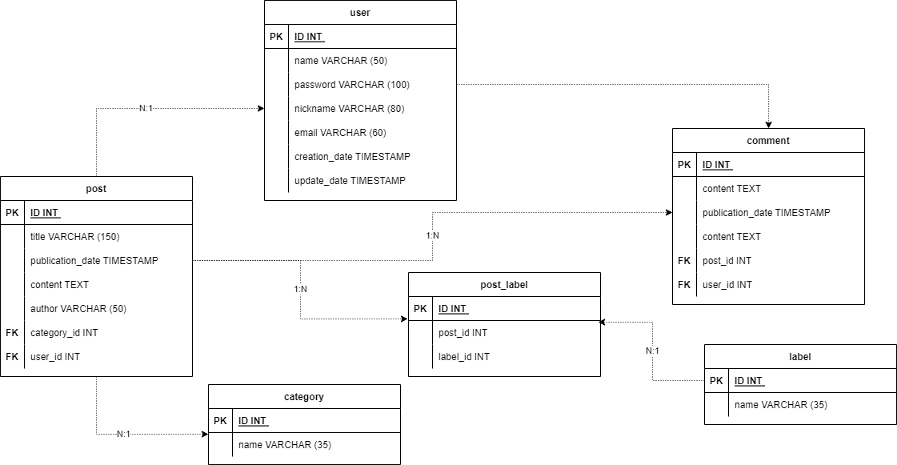

#  Blog Application

## Overview 

This project is oriented to educational purposes for the creation of an APIs system based on the DDD (Drive Domain Design) 
architecture using . Net technology.

The operation of the APIs is intended to manage thematic posts for developers to learn
new technologies and best practices in writing code using a structured system of BlogPosts.

The educational points evidenced are the following.

* Creation of API structures.
* Use of .Net Core.
* Use of Entity Framework (Fluent API).
* Creation of Docker containers for database administration and application encapsulation.
* PostgresSQL as main database engine.
* Manage of DDD (Drive Domain Design) architecture
* Setting up an optimized test environment with Xunit
* Integration and unit testing with Xunit.

## Table of Contents

1. How to run. 
2. Testing.
3. Entity-relationship diagram
3. Endpoints.
4. Technologies used.
5. Resources.

## How to run

For run this project you need the next requirements.

- [.NET Core 6.0 Version](https://dotnet.microsoft.com/en-us/download).
- [Docker](https://docs.docker.com/get-docker/).

The BlogApplication.Api project contains the program class and the API configuration 
through the launchSettings.json file to be executed. In this folder you have to execute 
the following command. 

        dotnet run

You will see the next logs.

    info: Microsoft.Hosting.Lifetime[14]
    Now listening on: http://localhost:5123
    info: Microsoft.Hosting.Lifetime[0]
    Application started. Press Ctrl+C to shut down.
    info: Microsoft.Hosting.Lifetime[0]
    Hosting environment: Development
    info: Microsoft.Hosting.Lifetime[0]
    Content root path: C:\yourDirectory\bloggerApp\main\BlogApplication.Api\

## Testing

Blog Application has a testing section composed of unit tests 
that allow evaluating the behavior of the application prior to its main execution. 
***It is important to have docker running beforehand***.

    dotnet test

You will see the next logs (Example).

    Determinando los proyectos que se van a restaurar...
    Todos los proyectos estan actualizados para la restauracion.
    BlogApplication.Domain -> C:\yourDirectory\bloggerApp\main\
    BlogApplication.Domain\bin\Debug\net6.0\BlogApplication.Domain.dll
    BlogApplication.Application -> C:\yourDirectory\bloggerApp\main\
    BlogApplication.Application\bin\Debug\net6.0\BlogApplication.Application.dll
    BlogApplication.Infrastructure -> C:\yourDirectory\bloggerApp\main\
    BlogApplication.Infrastructure\bin\Debug\net6.0\
    BlogApplication.Infrastructure.dll
    BlogApplication.Api -> C:\yourDirectory\main\
    BlogApplication.Api\bin\Debug\net6.0\BlogApplication.Api.dll
    test -> C:\yourDirectory\bloggerApp\test\bin\Debug\net6.0\test.dll
    Serie de pruebas para C:\yourDirectory\bloggerApp\test\bin\Debug\net6.0
    \test.dll (.NETCoreApp,Version=v6.0)
    Herramienta de línea de comandos de ejecución de pruebas de Microsoft(R)
    , versión 17.4.0 (x64)
    Copyright (c) Microsoft Corporation. Todos los derechos reservados.
    Iniciando la ejecución de pruebas, espere...
    1 archivos de prueba en total coincidieron con el patrón especificado.
    Correctas! - Con error:     0, Superado:    26, Omitido:     0, 
    Total:    26, Duración: 2 s - test.dll (net6.0)

## Entity-relationship diagram

The following is a list of all project entities.



## Endpoints 

To consume the main Posts BlogApplication creation service use the following endpoints.

   1. Check operation.
   2. Create Database Schemas.
   3. Find all posts.
   4. Find post by id.
   5. Create a post.
   6. Update a post.
   7. Delete a post.

### 1. Check Operation

*Request*

**Method**: `GET`

**URL**: `http://localhost:5123/post/api/ping`

*Response*

    pong

### 2. Create Database Schemas

*Request*

**Method**: `GET`

**URL**: `http://localhost:5123/post/api/connection`

*Response*

    database created

### 3. Find all posts

*Request*

**Method**: `GET`

**URL**: `http://localhost:5123/post/api/posts`

*Response*

```json 
[
     {
        "id": "e97de533-9e22-4944-92bc-bdd799b6c786",
        "userId": "8dd1b477-0d2b-42ae-bfd3-0de9d74b7fcc",
        "categoryId": "b7d0bbf0-a1e9-4dbd-845b-f8e751160001",
        "title": "Clean House Tips",
        "publicationDate": "2022-11-03T20:47:25.333816",
        "content": "Proin finibus sodales purus, et luctus urna laoreet ullamcorper. Donec vitae dapibus massa. Suspendisse id maximus risus",
        "author": "Santiago",
        "status": true,
        "user": {
            "id": "8dd1b477-0d2b-42ae-bfd3-0de9d74b7fcc",
            "name": "Fabiana",
            "password": "123456",
            "nickname": "Fabiana50",
            "email": "fabiana@mail.com",
            "creationDate": "2022-11-03T20:47:25.333589",
            "updateDate": "2022-11-03T20:47:25.333605"
        },
        "category": {
            "id": "b7d0bbf0-a1e9-4dbd-845b-f8e751160001",
            "name": 2
        }
    }
]
```

### 4. Find post by id

*Request*

**Method**: `GET`

**URL**: `http://localhost:5123/post/api/posts/:id`

*Response*

```json 
[
     {
        "id": "e97de533-9e22-4944-92bc-bdd799b6c786",
        "userId": "8dd1b477-0d2b-42ae-bfd3-0de9d74b7fcc",
        "categoryId": "b7d0bbf0-a1e9-4dbd-845b-f8e751160001",
        "title": "Clean House Tips",
        "publicationDate": "2022-11-03T20:47:25.333816",
        "content": "Proin finibus sodales purus, et luctus urna laoreet ullamcorper. Donec vitae dapibus massa. Suspendisse id maximus risus",
        "author": "Santiago",
        "status": true,
        "user": {
            "id": "8dd1b477-0d2b-42ae-bfd3-0de9d74b7fcc",
            "name": "Fabiana",
            "password": "123456",
            "nickname": "Fabiana50",
            "email": "fabiana@mail.com",
            "creationDate": "2022-11-03T20:47:25.333589",
            "updateDate": "2022-11-03T20:47:25.333605"
        },
        "category": {
            "id": "b7d0bbf0-a1e9-4dbd-845b-f8e751160001",
            "name": 2
        }
    }
]
```

### 5. Create a post

*Request*

**Method**: `POST`

**URL**: `http://localhost:5123/post/api/posts`

**Body**:
``` json
{
   "title":"John Roberto's Article",
   "content":"Lorem ipsum dolor sit amet, consectetur adipiscing elit",
   "author":"John",
   "user":{
      "name":"John",
      "password":"123456",
      "nickname":"John82",
      "email":"John@mail.com"
   },
   "category":{
      "name":1
   }
}
```

*Response*

```json
{
    "id": "3c1f69f8-dd26-4d20-8996-7c5912d280f4",
    "userId": "d52a512c-dff9-4f33-a02d-ba9b403db978",
    "categoryId": "e2e5230e-9c88-4e2b-b66d-7dfad736dbcf",
    "title": "John Roberto's Article",
    "publicationDate": "2022-11-03T20:47:25.333816",
    "content": "Lorem ipsum dolor sit amet, consectetur adipiscing elit",
    "author": "John",
    "status": true,
    "user": {
        "id": "d52a512c-dff9-4f33-a02d-ba9b403db978",
        "name": "Johnsito2",
        "password": "123456",
        "nickname": "John82",
        "email": "John@mail.com",
        "creationDate": "2022-11-03T20:47:25.333589",
        "updateDate": "2022-11-03T20:47:25.333605"
    },
    "category": {
        "id": "e2e5230e-9c88-4e2b-b66d-7dfad736dbcf",
        "name": 1
    }
}
```

### 6. Update a post

*Request*

**Method**: `PUT`

**URL**: `http://localhost:5123/post/api/posts/:id`

**Body**:

```json
{
  "title": "Karo's Article",
  "content": "Lorem ipsum dolor sit amet, consectetur adipiscing elit",
  "author": "Karol",
  "user": {
    "name": "Karol",
    "password": "123456",
    "nickname": "Karol42",
    "email": "Karol@mail.com"
  },
  "category": {
    "name": 0
  }
}
```

*Response*

```json
{
  "id": "e97de533-9e22-4944-92bc-bdd799b6c787",
  "userId": "b893178d-fc08-4e51-bee2-7cb5f3a52561",
  "categoryId": "8bd21e48-c741-4c76-a30b-bfa1bbf1c986",
  "title": "Karo's Article",
  "publicationDate": "2022-11-03T20:47:25.333816",
  "content": "Lorem ipsum dolor sit amet, consectetur adipiscing elit",
  "author": "Karol",
  "status": false,
  "user": {
    "id": "b893178d-fc08-4e51-bee2-7cb5f3a52561",
    "name": "Karol",
    "password": "123456",
    "nickname": "Karol42",
    "email": "Karol@mail.com",
    "creationDate": "2022-11-03T20:47:25.333589",
    "updateDate": "2022-11-03T20:47:25.333605"
  },
  "category": {
    "id": "8bd21e48-c741-4c76-a30b-bfa1bbf1c986",
    "name": 0
  }
}
```
### 7. Delete a post

*Request*

**Method**: `DELETE`

**URL**: `http://localhost:5123/post/api/posts/:id`

*Response*

```json
{
    "id": "3c1f69f8-dd26-4d20-8996-7c5912d280f4",
    "userId": "d52a512c-dff9-4f33-a02d-ba9b403db978",
    "categoryId": "e2e5230e-9c88-4e2b-b66d-7dfad736dbcf",
    "title": "John Roberto's Article",
    "publicationDate": "2022-11-03T20:47:25.333816",
    "content": "Lorem ipsum dolor sit amet, consectetur adipiscing elit",
    "author": "John",
    "status": true,
    "user": {
        "id": "d52a512c-dff9-4f33-a02d-ba9b403db978",
        "name": "Johnsito2",
        "password": "123456",
        "nickname": "John82",
        "email": "John@mail.com",
        "creationDate": "2022-11-03T20:47:25.333589",
        "updateDate": "2022-11-03T20:47:25.333605"
    },
    "category": {
        "id": "e2e5230e-9c88-4e2b-b66d-7dfad736dbcf",
        "name": 1
    }
}
```
The structures of the ***comment*** and ***user*** entities are similar to those described above.

## Technologies used

* [.NET Core](https://dotnet.microsoft.com/en-us/download): Version 6.0
* [Docker](https://docs.docker.com/get-docker/): Version 20.10.17
* [PostgresSQL](https://www.postgresql.org/): Version 12
* [TestContainers](https://www.testcontainers.org/) : Version 1.16.3
* [XUnit](https://xunit.net/) : Version 2.4.2

## Resources 

### Diagrams 

This project has the following diagrams.

* Entity Relationship Diagram (ER)

For see this diagram use [diagrams .net](https://www.diagrams.net/).

*Download*

   **PATH:**
   
[`./bloggerApp/resources/blogApplicationRelationsDiagram`](resources/blogApplicationRelationsDiagram)

* DDD (Drive Domain Design) functional diagram. 


